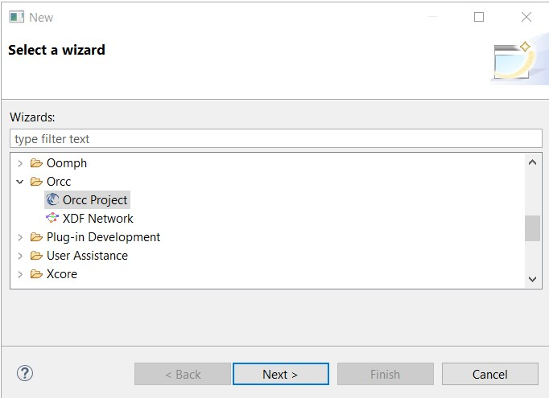
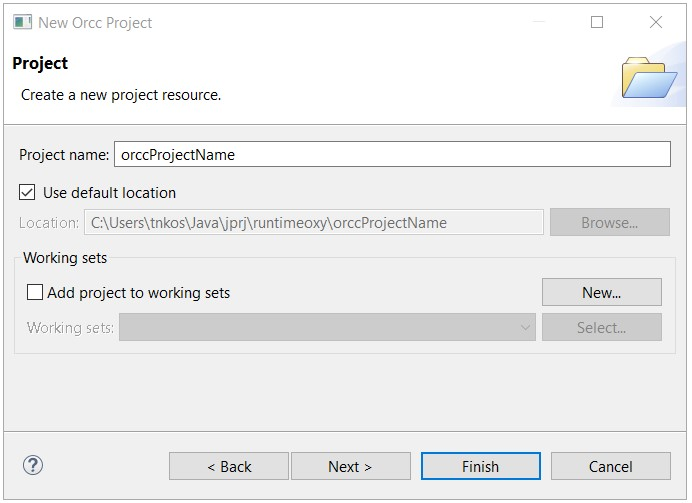
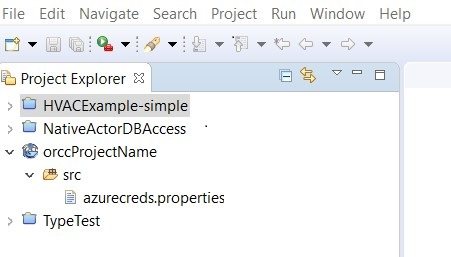
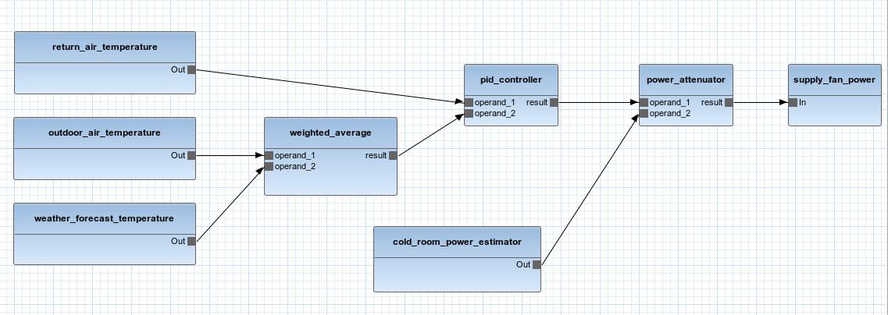

# Basic Concepts in ORCC-IoT

## ORCC-IoT Project

Start the Eclipse that already has the ORCC-IoT plugin installed and follow these steps:
1. File -> New -> Other 

2. From the dialog box, select Orcc Project and hit Next.   

3. Provide the name of your project, e.g. orccProjectName     

Project Explorer should show the *orccProjectName* project and its content.     

Folder *src* is where actors, their packages and networks are stored. The azurecreds.properties file is
where the credentials for the cloud are stored. Current implementation of Java cloud generates the code in Java Spring flavor, Docker container and configuration files for Microsoft Azure. 
The azurecreds.properties  has no significance if cloud backend is not used, thus this file should
not be changed. 

## Backend
In ORCC IoT, the **backend** denotes the engine that produces the source files of the IoT application. To compile the network using e.g. C backend means to produce the source files in C for that particular network. Several backends can be used to compile the networks such as: Plain java, Java Spring (cloud), C, etc… To address the platform heterogeneity problem, which is one of the dominant problems in IoT development, the ORCC-IoT offers the **Heterogeneous IoT backend**. 

Heterogeneous IoT backend allows developers to group the actors in partitions and to compile each partition with different backend while preserving the communication logic. The end results is therefore the network of actors implemented in different languages and compiled for different platforms that seamlessly collaborate to fulfill the IoT application’s goals. 

Partitions for Heterogeneous IoT backend are defined using especial XML-based syntax that is explained in [this](https://www.researchgate.net/publication/331319887_Dataflow-based_Heterogeneous_Code_Generator_for_IoT_Applications) publication. 

## Network
IoT applications are represented as a data-flow networks in ORCC-IoT. These networks consist of one or more 
interconnected actors, each representing a distinct parts of the IoT application. Once finalized, these networks are compiled by ORCC-IoT resulting with concrete source code. For example, during the compilation several actors from the network 
can be compiled to generate the .java code, while the remaining are compiled to generate the C code. The generated java and c files can then be compiled for their corresponding
target platforms and deployed without any modifications.  During the execution, java and c parts of the application are fully aware of each other and able to communicate seamlessly. 
Example network is presented i Figure 1. 

## Actor 
Actor encapsulates a distinct part of the IoT application's functionality. The actor can be any device (sensor, actuator) or it can be an application running in the cloud. Actors can have zero or more input ports, through which they
can consume data from other actors, and output ports (zero or more), through which they can provide data to other actors in the network. The
Actor's functionality, or behavior, is defined with the [CAL Actor language](https://en.wikipedia.org/wiki/CAL_Actor_Language).
The .cal units are used during the network compilation to produce the software code for each actor and the code for the network as a whole. 
In Figure 1, actors are represented with blue rectangles. There are two types of actors:

1. regular actor (or just actor)
2. native actor   

### 1. Regular Actor
As its name suggests, is an actor that is built from scratch by ORCC-IoT user to represent one of the IoT application's functionality. 
It is written in cal language, and compiled using the selected backends. The compilation network (of actors) results with software code
(e.g. .java or .c units). This code is then compiled for, and deploy to target hardware platform.

Here is a basic [tutorial](CompileWithORCC.md) on how to create and compile the network with regular actors.  

### 2. Native Actors
Native actor is a ready made actor that can be used in ORCC IoT networks. Compared to regular, native actors come with executables
(e.g .jar packages) that are ready for deployment to target platform. The cal definition of these actors allow user to connect it 
with other actors in the network via its input and output ports and to pass the necessary parameters for configuration. During the 
compilation of the ORCC-IoT network, native actors are not compiled as regular actors since they are accompanied with its executable
package that is built into the IoT application that is being made.

To learn more about native actors, see this [tutorial](NativeActors.md). 