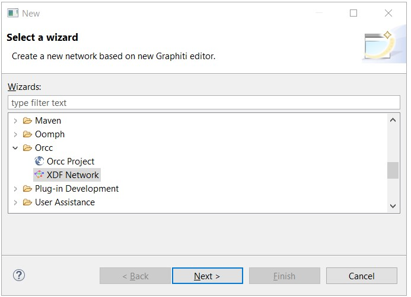
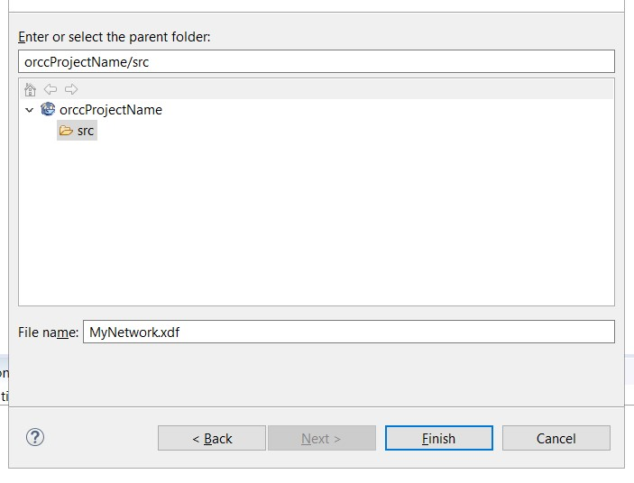
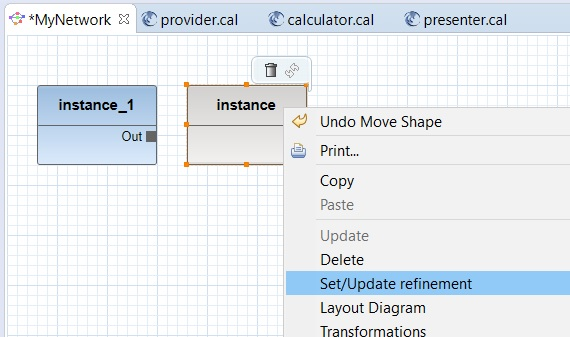
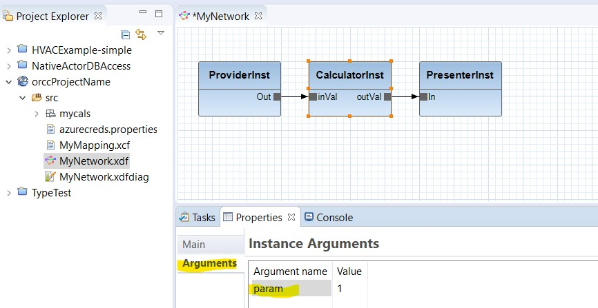
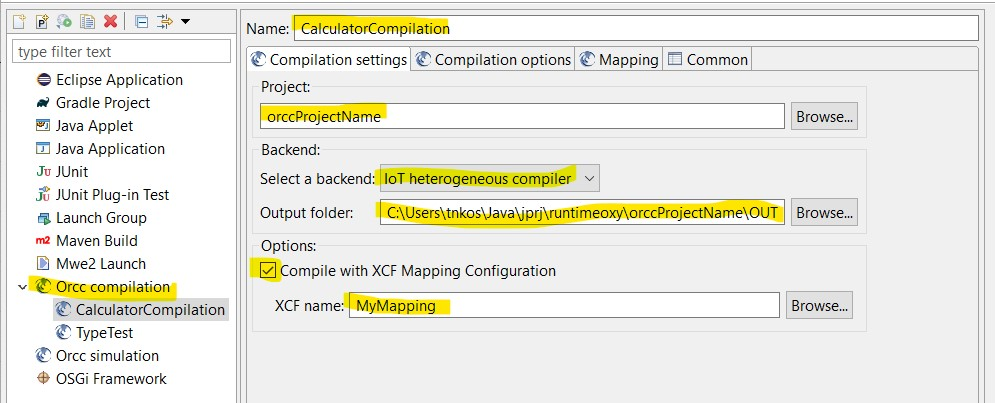

# Compile with ORCC-IoT

This tutorial will demonstrate how to make a simple ORCC-IoT application. 

**First step** is to create the ORCC project. If you are unfamiliar with this, follow the 
steps described in [BasicConcept](BasicConcepts.md) page. 

**Second step** is to create the network. The easiest way to do this is to right click on *orccProjectName* folder
and slelect new -> Other. From the folder list, select Orcc and then XDF Network, as presented in Figure 1. Hit *Next* when done...

 

Provide a name for the network and clikck *Finish*. Make sure that the *src* folder is selected, otherwise you will not be able to progress. 



**Third step** is to create actors. Each actor in the network is instantiated from the .cal source file, or .cal unit. Cal units are organized in packages
just as .java units are. To create a package, right click on *src* folder and select new -> package. Then provide the name 
for the package, e.g. mycals. 

To create .cal units, right click on *mycals* package and select new -> Other -> General -> and double click on *File*. 
Click on Next button, and provide the name e.g. *provider.cal* . Open the provider.cal file and paste the following code:

```
package mycals;

actor provider() ==> int Out:
	
	uint counter := 1;
	
	actProvider: action  ==> Out:[counter]
	guard counter < 11
	do
		counter := counter + 1;
		println("Sending (" + counter + ") to output port.");
	end
end
```
Notice that the package name must correspond with the name of the package where the unit is, 
and that actor name must correspond to the name of the .cal file. 

**Fourth step** is to create two actors, calculator.cal and presenter.cal. Upon creation of files, paste the corresponding code that is provided below.

```
package mycals;

actor calculator(int param = 0) int inVal ==> int outVal: 
		
		int result :=0;
		actCalc : action inVal:[value] ==> outVal:[result]
		do 
			result := value + param;
			println("Input value is: " + value + " actor parameter is: " + param);
			println("Calculating and sending to output port...");
		end
end
```
Notice here that actor calculator accepts one argument of integer type with default value 0.
Setting the default value for arguments is mandatory, otherwise the error is thrown.  


```
package mycals;

actor presenter() int In ==> :

	actPresenter: action  In:[val] ==> 
	do
		println("Calculated result is: " + val );
	end
end
```

**Step five** will demonstrate two typical ways how to put actors on a network. These types are:
1. Drag&Drop: In Project Explorer click on the actor (e.g provider.cal), drag the file to the network canvas 
(MyNetwork.xdf) and drop. The actor is presented as blue rectangle, with a default name and its ports. This 
actor represents a concrete *instance* of the functionality defined in .cal unit.   
2. Drop Instance: From the palette, click on the Instance and then click on the 
network canvas to drop the actor. This actor is not related to any .cal units 
thus it is represented whit brown color, without input or output ports. 
To relate the actor with .cal, right click and select  *Set/Update refinement* 
and select the .cal unit.  



The actor is now presented with blue color and has its input and output ports. Rename the actor instances to *ProviderInst*, *CalculatorInst* *PresenterInst*. 
Keep also in mind that several actor instances from the same .cal unit can be dropped on a same network. 

Finally, to connect the actors use the *Connection* from the tool palette to 
connect inputs and outputs. 
Network should look as in the following picture. 



Note that CalculatorInst actor receives an argument. To edit the argument's default value
select the actor, and click on properties tab and click on *Arguments*. The argument and 
its default value is presented. Select the param and click *edit* to change, e.g. from 0 to 1. 
 
**Step six** introduces the mapping of actors with their backends. Create the new file, name 
it e.g. MyMapping.xcf and paste the following code: 

```
<?xml version="1.0" encoding="UTF-8"?>
<Configuration>
    <Network file-format="xdf" qualified-id="MyNetwork"/>
    <Partitioning>
        <Partition id="server" pe="x86_0" backend-id="SpringBack" host="intel_server">
            <Instance id="CalculatorInst"/>
        </Partition>

        <Partition id="prov" pe="x86_1" backend-id="JavaBack" host="intel_server">
            <Instance id="ProviderInst"/>
        </Partition> 
        
        <Partition id="pres" pe="x86_1" backend-id="JavaBack" host="intel_server">
            <Instance id="PresenterInst"/>
        </Partition>         
    </Partitioning>
    <Backends>
        <Backend id="SpringBack" backend="Java-Spring"/>
        <Backend id="JavaBack" backend="Java">
        	<Parameter key="Board" value="Beaglebone Black"/>
        </Backend>
    </Backends>
    <Media>
        <Interface id="wifi" medium="Wifi">
            <Parameter key="Server IP Address" value="192.168.0.1"/>
        </Interface>
    </Media>
    <Connections>
        <Fifo-Connection src="ProviderInst" src-port="Out" dst="CalculatorInst" dst-port="inVal" size="512" medium-id="wifi"/>
        <Fifo-Connection src="CalculatorInst" src-port="outVal" dst="PresenterInst" dst-port="In" size="512" medium-id="wifi"/>
    </Connections>
</Configuration>
```
Mapping file is an XML based document that relates actor instances with backends that will be used for their compilation. 
In this example, two actors instances, Provider and Presenter, will be compiled with plain Java backend, 
while the calculator is set to be compiled with Java Spring backend. Java Spring backend will produce the code that 
is set to be executed in the cloud.


In **step seven**, the network will be compiled using the *heterogeneous compiler* especially built for IoT applications.
Keep in mind that if one of your backend is Java-Spring, the azurecreeds.property file has to be populated with real values. 
Otherwise the generation of queues and deployment will fail. To compile the network, in Project explorer, right click on 
the network file (e.g. MyNetwork.xdf) and select RunAs -> Run Configuration. The following window will open:  



Set the following options:
 
1. CalculatorCompilation — Set the name of this compilation configuration. There can be several configuration for compiling a single network.
2. Project — Browse the project where the network you wish to compile is. 
3. Select a backend — Chose IoT heterogeneous compiler
4. Output folder — Select a folder for the compilation results. 
5. Check the *Compile with XCF Mapping Configuration* — Select the mapping to compile (e.g. MyMapping.xcf)

Run the compilation... 

Navigate to output folder to check the result. 

The otput folder contains three folders: bin, graph, partitions. The partitions folder contains three folders, each corresponding to the
partition defined in *MyMapping* file - *prov*, *server* and *pres*. Partition *prov* holds the code of the provider actor, 
*server* holds the code for calculator, and the *pres* fro the presenter.


## Compiling the plain Java 

To compile the provider and presenter actor, in both *prov* and *pres* folders, execute this command:

```mvn package```

from command line. This will generate the .jar package that will be placed in the *bin* folder. 
 

## Compiling the Java Spring

*Prerequisites: Install the following applications: 
1. The [*az*](https://docs.microsoft.com/en-us/cli/azure/?view=azure-cli-latest) command line utility. The user has to be logged in, 
use *az login* form the command line to login. 
2. [Docker](https://www.docker.com/). Install with sudo or administrator privileges.   

In output folder, browse to *partition/server* folder. There are two options for compilation:
1. Execute ```mvn package``` to create .jar package in *target* folder. This package can be used to launch the server code locally. 
To launch the application execute ```java -jar target/name-of-jar-package.jar``` form command line to launch. 
2. Execute ```mvn install``` to automatically: create .jar package, necessary queues in the cloud, docker image, image deployment, instantiation 
of the image, and to launch the application. 

*Keep in mind that both options use cloud resources e.g. queues or mongo database, thus these resources must be accessible in the cloud and the 
azurecreeds.property file populated.*

## Application in action

To see the application in action, launch the producer and presenter actor. To launch, execute ```java -jar bin/name-of-jar-package.jar ws://localhost:8080/iopod``` 
both from *prod* and *pres* folder.  If the server partition (Calculator actor) is executed on a remote server use the IP address instead of localhost, 
e.g. ```java -jar bin/name-of-jar-package.jar ws://57.36.250.12:8080/iopod```

The producer actor will generate several integer values and send them to calculator. The calculator receives the value from input port and performs
an addition with the parameter value (param is set to 1 in step five). The result is sent to output queue and then to presenter actor. The presenter
actor receives the value and prints the value on the screen.  

The entire project used in this example can be downloaded from [here](resources/orccProjectName.zip).