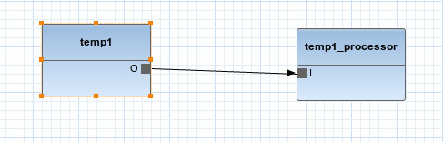
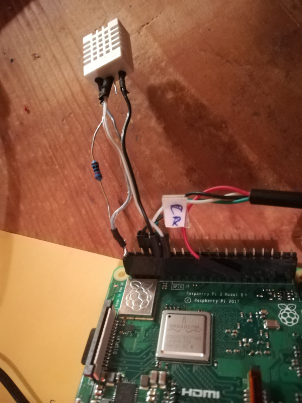

# Native actor in C language

The example project in this page describes a native actor implemented in C. The motivational example is a temperature sensor with the Raspberry Pi. The application running on the
embedded computer takes samples from the DHT-22 temperature sensor and sends it to the server running in the cloud. The simple application has the following model:



This project can be downloaded from [here](resources/temp_proj.zip). 

The XCF file in the project associates temp1 actor to the C backend and temp1_processor to the Spring/Java backend  and the IoT heterogeneous compiler
generates two projects, one in C, one in Spring/Java. The result is that temp1 is generated in C and as the two actors
reside on different processing elements (PE), network communication code will be automatically created between the two actors. The sampling logic of the temp1 actor cannot be described
in CAL, however. Hence this actor is a native actor and its CAL description is just a stub.

```
package actors;

@native actor temperature_sensor() ==> float O:
end
```

The DHT-22 sensor is wired to the Raspberry Pi like in the image below:



The following connections have been made (RPI-DHT 22):

* Pin 1-Pin 1 (Vcc)
* Pin 9-Pin 4 (Gnd)
* Pin 11-Pin 2 (Data)

In addition, a 10 kOhm resistor must be placed between the Vcc and Data pin.

When the C backend encounters a native actor, it just generates an incomplete stub source file and does not include that file into the CMake project. If you compile
the C project, it will fail as the code for the temp1 actor is missing. [Download this archive](resources/temp_actor.zip) and unpack it into the libs subdirectory of
the C project. Also, add this subdirectory to the CMakeLists.txt file in the libs subdirectory.

```
add_subdirectory(temp_actor)

```

Then add this library to the CMakeLists.txt file in the src subdirectory.

```
target_link_libraries(subnetwork1 temp_actor orcc-native ...

```

Compilation of the updated project will succeed. If you decide to try it on the Raspberry Pi, the simplest approach is to compile the project on the Pi itself. In this case do not forget
to install libwebsocket and cjson on the Pi too.
