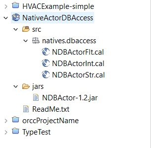
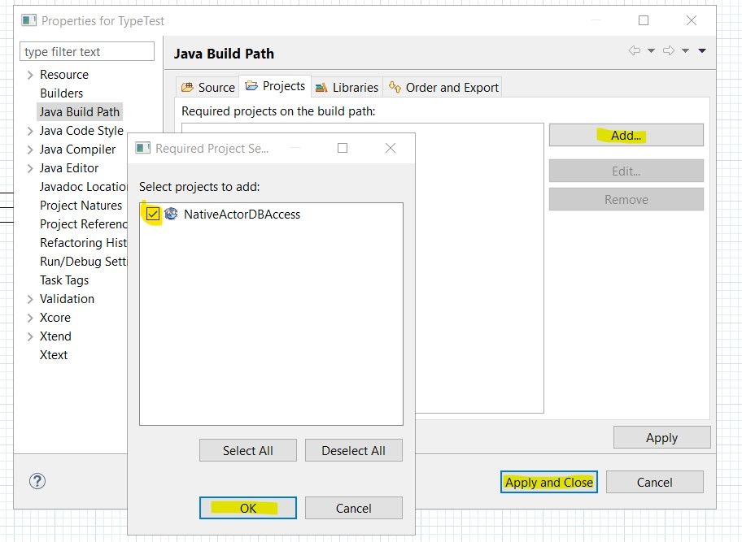

# Native Actors in ORCC-IoT

Native actors come in the form of orcc project, thus to use them, these projects must be *imported* into the workspace. 
To import a native actor project go to: File -> Import -> Select *General* from the folder list - > Existing project 
into workspace. Navigate to the root directory of the native actor project and click *Finish*. 

Throughout this tutuorial, a native actor for storing values into database will be used.  This native actor has the following structure: 



The project contains four actors, represented with their .cal units. Each actor receives the value of different type and stores it into the database. For example, 
to store the integer values, NDBActorInt should be used in the network, For storing strings, NDBActorStr and for float data type, NDBActorFlt. 

The code below presents the NDBActorInt native actor.  

```
package natives.dbaccess;

@jar(artifactid = "NDBActor", jarversion = "1.2")
@backend(id = "java-spring") 
@native actor NDBActorInt (String tblName = "InputData", String connectionURI = "", String instanceName = "actor") int dbIN ==>:

	//receives values of type Integer, and stores them in a database...

end
```

Native actors have the ``@native`` annotation, their signature (name, parameter, inputs and outputs) and no body. Besides this
the .cal units of native actors must include two additional annotations - ``@jar`` and ``@backend``. 
1. ``@jar`` annotation: provides information about the package id and its version.
2. ``@backend`` annotation: sets the backend that compiles this native actor. In this example, the "java-spring" backend is set, thus in case any other backend
tries to compile this unit, the error is thrown. 

This native actor also has three parameters. These parameters are: 

 
1. ``String tblName = "InputData" `` : If the table name is the same (e.g. InputData) for all instances of the native actor, then 
 the input data for all instances will be stored in a single data base table (or collection) named InputData. If the tblName parameter is changed   
 (e.g. MyData) for a native actor instance, then the input data of that particular instance will be stored in the dedicated data base 
 table named as the tblName parameter value - MyData in this example.
 
2. ``String connectionURL = ""`` : URL for connecting to database. Current implementation allows connection to MongoDB in Azure Cloud. 
 
3. ``String instanceName = "actor"`` : Name of the native actor instance. This param is stored in database next to the value. It is used to differentiate
 stored values from different native actors in a single db table or collection. 

To use the native actor, create the new ORCC project and set the build path to reference the native actor project. To set the build path follow these steps:
1. Right click on the newly created project and go to Build path -> configure Build path 
2. Click on Add button -> tick the box next to the native actor project -> click OK -> click Apply and Close. 



Once the build path is configured, the native actor can be used in the network it the same way how regular actors are used - e.g. drag&drop from project explorer
to network canvas. 

The native actor used in this example can be downloaded from [here](resources/NativeActorDBAccess.zip).
Note that this native actor is missing the actual implemetation, that is the .jar package. 
To implement the native actor, follow [this](NativeActorImpl.md) tutorial. 

