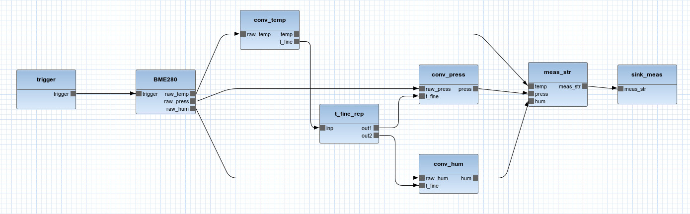

# Orcc-IoT extension package

Orcc-IoT comes with a C code generator that creates a Websocket-based client code that talks to the Spring Java generated code
on the server side. This is a rather naive implementation that does not work on small embedded environments that do not
have operating system with TCP stack in them. Fortunately Orcc-IoT in general and the IoT heterogeneous compiler backend
in particular is modular and can be extended with installable packages. Orcc-IoT extension package is an example
of this mechanism. This extension package may be installed alongside of Orcc-IoT and adds two backends.

* STM32F4 backend is a C code generator targeting the STM32F4xx family of microcontrollers connected to SIM7000 cellular
  communication modules.
* Spring Java-GSMAdapter is a variant of Orcc-IoT built-in Spring Java code generator that is adapted to the
  communication patterns available from the SIM7000.

This extension package is meant to be a demonstration, what needs to be done to support a particular hardware by Orcc-IoT.
Even though generic code generators like the C code generator can do most of the work, there is a high 
probability that the runtime and communication code needs to be adapted to the particular hardware.

The code generated by this extension package does not implement security aspects. In particular, the generated code
does not implement end-to-end security and client authentication that makes the generated server code unsuitable
for product-grade deployment. 

## Installation

The installation requirements of the extension package are the same as Orcc itself.

First clone the repository into a directory for which we will use the shorthand $REPO_DIR.

```
git clone https://github.com/paller42/orcc-iot.git
```

Enter the $REPO_DIR/orcciot_addons/eclipse/plugins directory and issue the command:

```
mvn package
```

This builds the Eclipse packages. In order to install these packages, click Help/Install new software ... in Eclipse
then click Add ... and Local ... then select the $REPO/orcciot_addons/eclipse/plugins/hu.sze.orcciot.site/target/repository
directory. Orcc-IoT extension package should now appear as an installation candidate. Select it, click through the wizard
and install the package.

Once Orcc-IoT extension package is installed, XCF hardware mapping file may refer to these two backends as Java-Spring-GSMAdapter and STM32F4-C. E.g.

```
   <Backends>
        <Backend id="Java_Server" backend="Java-Spring-GSMAdapter"/>
        <Backend id="stm32f4" backend="STM32F4-C"/>
   </Backends>
```

## Weather pole example project

### Requirements

The extension package will be demonstrated by an example project. This project is about a weather station that
measures temperature, pressure and humidity values and sends them to a server component deployed into the Azure cloud. The  weather station hardware is based on the STM32F407 microcontroller, the SimCom SIM7000E cellular module and the Bosch BME280 combined environment sensor. I used the following prototyping boards to build a quick setup of this hardware.

* [STM32F4DISCOVERY Discovery kit](https://www.st.com/en/evaluation-tools/stm32f4discovery.html)
* [Waveshare SIM7000E NB-IoT HAT](https://www.waveshare.com/wiki/SIM7000E_NB-IoT_HAT)
* GY BME280 Breakout

The hardware does not depend on these prototyping boards, you can use the referred modules from other sources too.

The STM32F407 microcontroller talks to SIM7000E over the USART2 serial interface and to the BME280 over the I2C1 controller.
The following connections have to be made.

* STM32F407 PA.2 (USART2 TX) - SIM7000E RX
* STM32F407 PA.3 (USART3 RX) - SIM7000E TX
* STM32F407 PB.9 (I2C1 SDA) - BME280 SDA
* STM32F407 PB.6 (I2C1 SCL) - BME280 SCL

In addition it is very helpful to connect a TTL serial adapter (such as Adafruit USB to TTL Serial Cable or similar)
to USART6 because the generated code produces debug messages over this interface.

* STM32F407 PC.6 (USART6 TX) - serial adapter RX

The generated code has a number of dependencies. The Spring Java code's dependencies are the same as the
original Orcc-IoT Spring Java code generator dependencies (check out the 
[Configuring the Azure deployment section](README.md) document).

Compiling the generated STM32F4xx code requires the following dependencies.

#### GCC ARM cross compiler

On Ubuntu-like systems the cross compiler can be installed with the following command:

```
sudo apt-get install gcc-arm-none-eabi
```

#### Newlib C library

Download the sources from [here](https://sourceware.org/newlib/download.html). The shorthand for the installation
directory will be $NEWLIB_DIR.

Enter $NEWLIB_DIR and issue the following command:

```
./configure --build=x86_64-pc-linux-gnu --host=arm-none-eabi CC=arm-none-eabi-gcc CFLAGS="-g -O2 -Wall -mlittle-endian -mthumb -mcpu=cortex-m4 -mthumb-interwork -mfloat-abi=hard -mfpu=fpv4-sp-d16"
```

Then build the library with the 

```
make
```

command.

#### STM32F4DISCOVERY board firmware package

The library can be downloaded from the [STM32F4Discovery Discovery kit's page](https://www.st.com/content/st_com/en/products/embedded-software/mcu-mpu-embedded-software/stm32-embedded-software/stm32-standard-peripheral-library-expansion/stsw-stm32068.html).
Its installation directory is denoted as $FW_DIR.

#### ST-LINK tools

Makefiles generated by the extension package refer to the st-burn tool from the 
[st-link](https://github.com/stlink-org/stlink) tool set. If you use the STM32F4DISCOVERY board, it is recommended to
install this tool set so that the microcontroller can be programmed by simply issuing the

```
make burn
```

command.

### Weather pole application 

The weather pole example consists of two parts.

#### Native function library

The weather pole application requires I2C bus handling and low-power mode support. These features are provided
by a native library whose functions are referenced directly from the Orcc-IoT model. The native library project 
is found under the $REPO_DIR/examples/weather-pole/native-library directory. Enter this directory, update the
STM_COMMON and NEWLIB variables according to the $NEWLIB_DIR and $FW_DIR values then type

```
make
```

This will compile the native library so that it can be referenced from the Orcc-IoT project.

#### The model

The weather pole application is described by its model. Access the model by clicking 
File/Import/Existing projects into Workspace then select root directory as $REPO_DIR/examples/weather-pole/orcc-model.
If the model has been successfully imported into the Eclipse workspace, you will see something like this:



If you open pole.xcf with Eclipse's text editor, you will see that only the sink_meas actor is associated to
the server backend, other actors run on the microcontroller. The server_side actor does not seem to do a lot
but the Java-Spring-GSMAdapter code generator creates server-side logic that saves incoming data to a database.

First about the server-side code generation configuration. Rename azurecreds.properties.example to azurecreds.properties
and fill its content according to your Azure credentials as described in the [Configuring the Azure deployment section](README.md) document.

The STM32F4 code generator needs to be configured as well. The configuration is in the stm32f4.properties file. The
default content refers to files on my computer so these need to be adapted like the following (replace $REPO_DIR and
friends with directories discussed above).

```
stm32f4.fw.path=$FW_DIR
stm32f4.newlib.path=$NEWLIB_DIR
stm32f4.server.address=1.2.3.4
stm32f4.server.port=8080
stm32f4.network.apn=my_apn
stm32f4.native.lib.dir=$REPO_DIR/examples/weather-pole/native-library
stm32f4.native.lib.name=native-actors
```

stm32f4.native.lib.dir and stm32f4.native.lib.name properties are optional, used only if the model has native functions.
This project has some, particularly related to I2C handling. E.g. in the BME280 actor:

```
@native function BME280_native_read_temp() --> int(size=32) end
```

which refers to a C function defined in the native_library project.

```
i32 BME280_native_read_temp();
```

stm32f4.network.apn property must be filled with the APN of the cellular network operator whose SIM card you inserted
into the SIM7000E module. stm32f4.server.address is the IP address or DNS name where the server component is deployed.
The default Docker-based deploy script generated by the Java-Spring-GSMAdapter code generator gets Azure to pick an IP address, this temporary solution needs to be replaced by a more permanent deployment.

Once the configuration is done, the code generators can be launched exactly as described [here](README.md). 
The output folder of the generated source tree will be denoted as $OUTPUT_DIR. The
backends controlled by the IoT heterogeneous compiler will generate two software projects in the target directory.

##### Server component

The server component is generated in the $OUTPUT_DIR/partitions/server_0 directory. The component is compiled and deployed
in Azure cloud service with the following command:

```
mvn install
```

In case you already have a server (physical or virtual) somewhere, the deployment phase can be skipped with the following command:

```
mvn package
```

In this case the executable JAR file is in the target subdirectory.

The network address or name of the server component must be updated in stm32f4.properties file, at the stm32f4.server.address
property.

##### Microcontroller component

The microcontroller component is generated in the $OUTPUT_DIR/weather_pole subdirectory. Enter this directory and 
issue the

```
make burn
```

command if your STM32F407 microcontroller is hosted on a Discovery prototyping board and the USB cable is connected.
In this case the generated code is compiled and flashed into the microcontroller. In case you have a custom
microcontroller hardware, the

```
make
```

will only compile the generated code.

If you connected a TTL serial adapter to USART6 TX, you will see a large amount of debug messages that indicates,
how the dataflow is executed in the microcontroller.


