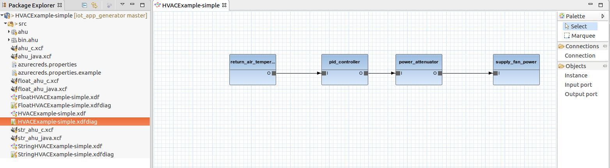
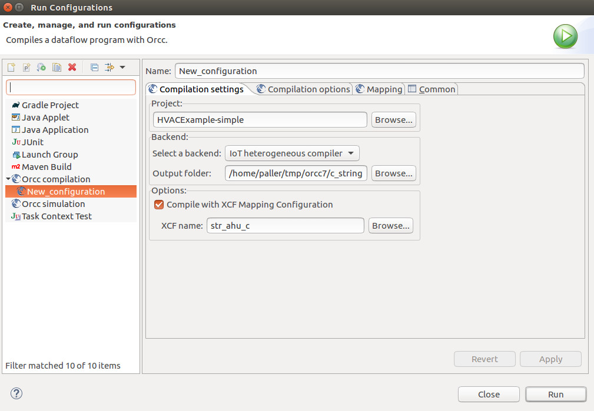

# Orcc-IoT

Orcc-IoT is an adaptation of the [Open RVC-CAL Compiler](http://orcc.sourceforge.net/) to IoT system design. The motivation of the project is described in
[this paper](https://www.researchgate.net/publication/331319887_Dataflow-based_Heterogeneous_Code_Generator_for_IoT_Applications). This repository contains
Orcc-IoT code, example projects and enough instructions to get you started.

The rest of this document deals with the installation and basic configuration of Orcc-IoT. The following table links to additional documents that
guide you in dataflow-based application design after you installed Orcc-IoT. 

* [Basic Concepts in ORCC-IoT](BasicConcepts.md)
* [Compile with ORCC-IoT](CompileWithORCC.md)
* [Native Actors in ORCC-IoT](NativeActors.md)
* [How to Implement the Native Actors](NativeActorImpl.md)
* [Native actor in C language](NativeActorInC.md)
* [Final report of the project (coding guidelines, further directions of development)](resources/Final Report.pdf)

# Prerequisites

* [JDK 1.8](https://www.oracle.com/technetwork/java/javase/downloads/jdk8-downloads-2133151.html)
* [Maven 3.5.8](https://maven.apache.org/download.cgi)
* [Eclipse 2019-03](https://www.eclipse.org/downloads/packages/release/2019-03/r)

Note that Orcc-IoT was successfully deployed on different versions of Eclipse but a new Eclipse release normally requires recompilation. In order to adapt to
a different Eclipse version, edit `orcc/eclipse/plugins/pom.xml` and update this line `<url>https://download.eclipse.org/releases/2019-03/201903201000</url>`
with the P2 repository of the Eclipse version in question.

# Compile & install

`cd orcc/eclipse/plugins`

`mvn package`

Launch Eclipse, then select Help/Install new software. Click on the Add button, select Local then select the 
orcc/eclipse/plugins/net.sf.orcc.site/target/repository subdirectory. Select the Orcc package and go ahead
with the installation using the Install new software wizard.

# Import the examples

In Eclipse, click File/Import/Existing Projects into Workspace. Click the Select root directory option then select the examples/xcf/ahu-simple directory.
Import the project in that directory then go into the src folder of the project and open HVACExample-simple.xdfdiag. You should see something like this:

# Generating and running example code

The example projects demonstrate Orcc-IoT's ability to cut the signal-flow graph into partitions and to generate executable code for each partition.
Implementation language/software stack for each partition may be different. The partitions - hence the architecture of the target system - are described
by the XCF file whose structure is specified in [the paper](https://www.researchgate.net/publication/331319887_Dataflow-based_Heterogeneous_Code_Generator_for_IoT_Applications). In short, the XCF file specifies the computing elements of the target systems, the expected
implementation language/stack for each partition and the connections among the partitions. The existing code generators do not use the connection
information contained in the XCF file.

The project provided the following code generators suitable for IoT implementations.

* C code generator that creates code with Linux library dependencies
* Plain Java code generator suitable for edge devices
* Java code generator with [Spring](https://spring.io/) flavor supporting Azure cloud deployment suitable for server functionality

## Configuring the Azure deployment

Prerequisites:

* [Azure management client](https://docs.microsoft.com/en-us/cli/azure/install-azure-cli?view=azure-cli-latest)
* [Docker](https://docs.docker.com/install/)

You also have to [give Docker sudo rights](https://docs.docker.com/install/linux/linux-postinstall/).

In order to enable the integration between the Spring/Java code generator and the Azure cloud, 
several configuration values must be provided. Orcc-IoT currently requires inserting these values into 
the azurecreds.properties file. An example version of this file has been provided in the project with the
name of src/azurecreds.properties.example. Make a copy of this file as src/azurecreds.properties.

Then edit the scripts/azure_create_acr.sh shell script and replace the configuration values 
(RESOURCE_GROUP ... COSMOSDB_ACCOUNT_NAME) with your identifiers. Then execute the script:

`az login`

`./azure_create_acr.sh`

This will create the artifacts in the Azure cloud that the Spring/Java code generator relies on. The script also dumps
keys and connection strings that you have to insert into your version of azurecreds.properties.

## Generating the code

The multi-node code generation is performed by the IoT heterogeneous compiler backend. This backend parses
the XCF file and invokes the appropriate backends for each node.

Let's see an example that exercises the C and the Spring/Java code generator.

Right-click on str_ahu_c.xcf in the example project and click on Run as/Run configurations. Fill the dialog like the following 
(use an output folder that suits your directory structure).

Click on the Run button and the IoT compiler will invoke the C backend twice and the Spring/Java code generator once and will
generate 3 software projects under the output folder's partitions subdirectory.

## Compiling/deploying the partitions

Enter the partitions/server_0 subdirectory then do:

`az login`

`mvn install`

This will compile the Spring/Java server module, create the necessary queues (event hubs in Azure parlance), create a Docker
build and deploy that Docker image into the Azure cloud.

Log in to the Azure portal and look for the container instances resource called hvacexamplesimplesubnetwork2. Under the Properties
menu item, you will find the public IP address of the container instance.

Now enter both the fan_power and the air_temp_0 subdirectories and compile the C projects in each.

Prerequisites:

* [libwebsockets](https://libwebsockets.org/)
* [cjson](https://github.com/DaveGamble/cJSON)

`cmake .`

`make`

Start the C instances as:

`bin/subnetwork1 <IP address>:8080`

`bin/subnetwork3 <IP address>:8080`

where <IP address> is the public IP address of the container instance you noted in the previous step.

If everything worked correctly, air_temp_0 instance sends data to the cloud instance and fan_power instance receives data from
the cloud instance.

## Additional resources:
1. [Basic concepts of ORCC-IoT](BasicConcepts.md) 
2. [Compile with ORCC-IoT](CompileWithORCC.md)
3. [Native Actors](NativeActors.md)
4. [Native Actor Implementation](NativeActorImpl.md) 

